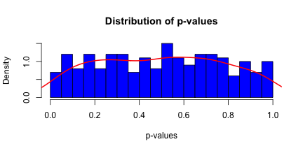
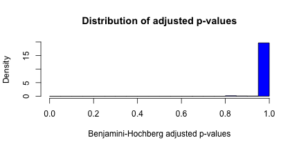

**Giusi Moffa**  
**Statistical bioinformatics, University of Regensburg**  
**Practical bioinformatics, 27 May 2014**  

p-values, one big topic for reproducible findings
========================================================

So let's look at how we can get a dynamic and reproducible report with `knitr`, for getting in the news.

This is an R Markdown document for producing dynamic reports.

### Recording the $R$ session
It may be useful since different versions in general will not produce identical results.


```r
# Print R session info
sessionInfo()
```

```
## R version 3.0.3 (2014-03-06)
## Platform: x86_64-apple-darwin10.8.0 (64-bit)
## 
## locale:
## [1] en_GB.UTF-8/en_GB.UTF-8/en_GB.UTF-8/C/en_GB.UTF-8/en_GB.UTF-8
## 
## attached base packages:
## [1] stats     graphics  grDevices utils     datasets  methods   base     
## 
## other attached packages:
## [1] knitr_1.5
## 
## loaded via a namespace (and not attached):
## [1] evaluate_0.5.5 formatR_0.10   stringr_0.6.2  tools_3.0.3
```


It is a good habit also to set your working directory and check whether you are in the right place.


```r
setwd("~/juicy/BioStatWork2012/mytex/journalClub/Reproducibility/repBioInfo")
getwd()  ## obtain the working directory
```

```
## [1] "/Users/giusimoffa/juicy/BioStatWork2012/mytex/journalClub/Reproducibility/repBioInfo"
```


## One old trick for getting in the news


Under the null-hypothesis p-values are expected to be uniformly distributed between 0 and 1. So if we have hundreds of crazy hypotheses we can try a fishing expedition for significance by testing all of them. On average 5% will come up as significant.


```r
set.seed(31)
nColors <- 200
nObs <- 100
jellyBeans <- matrix(rnorm(nObs * nColors), ncol = nColors)
fishing4News <- apply(jellyBeans, 2, function(x) t.test(x)$p.value)
```


If we like simple numbers we can look at a table of summaries (here only for a small number of variables, for space constraints)

```r
library(xtable)
options(xtable.type = "html")
xtable(summary(jellyBeans[, 1:8]), caption = "Some variables' summaries")
```

<!-- html table generated in R 3.0.3 by xtable 1.7-3 package -->
<!-- Wed May 28 14:44:12 2014 -->
<TABLE border=1>
<CAPTION ALIGN="bottom"> Some variables' summaries </CAPTION>
<TR> <TH>  </TH> <TH>       V1 </TH> <TH>       V2 </TH> <TH>       V3 </TH> <TH>       V4 </TH> <TH>       V5 </TH> <TH>       V6 </TH> <TH>       V7 </TH> <TH>       V8 </TH>  </TR>
  <TR> <TD align="right"> 1 </TD> <TD> Min.   :-2.5408   </TD> <TD> Min.   :-2.2187   </TD> <TD> Min.   :-2.3257   </TD> <TD> Min.   :-2.523   </TD> <TD> Min.   :-2.8219   </TD> <TD> Min.   :-1.874   </TD> <TD> Min.   :-2.1820   </TD> <TD> Min.   :-2.3628   </TD> </TR>
  <TR> <TD align="right"> 2 </TD> <TD> 1st Qu.:-0.6512   </TD> <TD> 1st Qu.:-0.6141   </TD> <TD> 1st Qu.:-0.7047   </TD> <TD> 1st Qu.:-0.425   </TD> <TD> 1st Qu.:-0.6714   </TD> <TD> 1st Qu.:-0.660   </TD> <TD> 1st Qu.:-0.5529   </TD> <TD> 1st Qu.:-0.5238   </TD> </TR>
  <TR> <TD align="right"> 3 </TD> <TD> Median :-0.0442   </TD> <TD> Median : 0.0846   </TD> <TD> Median :-0.1013   </TD> <TD> Median : 0.193   </TD> <TD> Median : 0.0329   </TD> <TD> Median : 0.112   </TD> <TD> Median :-0.0473   </TD> <TD> Median : 0.0927   </TD> </TR>
  <TR> <TD align="right"> 4 </TD> <TD> Mean   :-0.0151   </TD> <TD> Mean   : 0.0628   </TD> <TD> Mean   :-0.0306   </TD> <TD> Mean   : 0.113   </TD> <TD> Mean   :-0.0331   </TD> <TD> Mean   : 0.133   </TD> <TD> Mean   :-0.0343   </TD> <TD> Mean   : 0.0895   </TD> </TR>
  <TR> <TD align="right"> 5 </TD> <TD> 3rd Qu.: 0.6460   </TD> <TD> 3rd Qu.: 0.7606   </TD> <TD> 3rd Qu.: 0.7086   </TD> <TD> 3rd Qu.: 0.889   </TD> <TD> 3rd Qu.: 0.5866   </TD> <TD> 3rd Qu.: 0.780   </TD> <TD> 3rd Qu.: 0.5893   </TD> <TD> 3rd Qu.: 0.7168   </TD> </TR>
  <TR> <TD align="right"> 6 </TD> <TD> Max.   : 2.3414   </TD> <TD> Max.   : 2.2036   </TD> <TD> Max.   : 2.6253   </TD> <TD> Max.   : 2.159   </TD> <TD> Max.   : 2.5874   </TD> <TD> Max.   : 2.593   </TD> <TD> Max.   : 2.4150   </TD> <TD> Max.   : 2.6256   </TD> </TR>
   </TABLE>


A graph might be more pleasant. The distribution can be visualised through the `hist` function and `density` function.

```r
hist(fishing4News, col = 4, breaks = 20, freq = FALSE, main = "Distribution of p-values", 
    xlab = "p-values")
lines(density(fishing4News), col = 2, lwd = 2)
```

 


This way we get 7 significant results. This problem is well known in genomics and adressed by a plethora of methods for multiple correction. Transparency however is not always necessarily guaranteed, especially in in fields such as social science, and the issue is still a very much debated hot topic (E.g [The garden of forking paths: Why multiple comparisons can be a problem,
even when there is no "fishing expedition" or "$p$-hacking" and the research
hypothesis was posited ahead of time](http://www.stat.columbia.edu/~gelman/research/unpublished/p_hacking.pdf)).
<!-- Berger claims that it is ignored in epidemiology -->

### Correction for multiple testing
One way to account for multiple testing is by adopting the Benjamini-Hochberg correction. If we are "lucky" we can still get in the news after correcting for multiple testing, but we might need a rather larger number of crazy ideas.

```r
set.seed(7)
nColors <- 10000
nObs <- 20
jellyBeans <- matrix(rnorm(nObs * nColors), ncol = nColors)
fishing4News <- apply(jellyBeans, 2, function(x) t.test(x)$p.value)
BHfishing <- p.adjust(fishing4News, "BH")
```


When testing for 10<sup>4</sup> colours, and with a limited number (20 in this case) of observations we still get one significant result. However only 2 are below .8.

```r
min(BHfishing)
```

```
## [1] 0.01483
```

```r
sort(BHfishing)[1:5]
```

```
## [1] 0.01483 0.07893 0.83831 0.83831 0.83831
```


```r
hist(BHfishing, col = 4, breaks = 20, freq = FALSE, main = "Distribution of adjusted p-values", 
    xlab = "Benjamini-Hochberg adjusted p-values")
```

 


And if you really feel you need to, you can also save (and load) your entire workspace

```r
save.image(file = "fishing.RData")
load(file = "fishing.RData")
```


### Disclaimer
This report is freely available for the benefit of **science**, so that our steps on the way to the news can be checked by anybody who wishes to do so.
