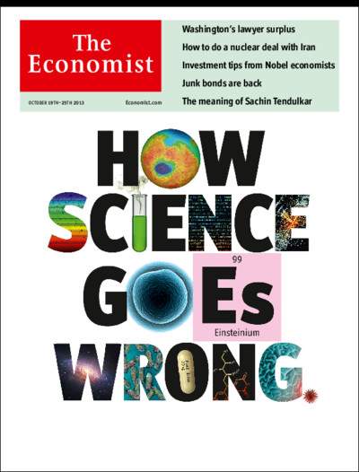

<!-- library(slidify) 
setwd("~/juicy/BioStatWork2012/mytex/journalClub/Reproducibility/repBioInfo")
slidify("index.Rmd")
publish(user="annlia", repo="reproduce") ## for github
http://annlia.github.com/reproduce
publish(title = 'reproducibility', 'index.html', host = 'rpubs') ## for Rpubs
https://help.github.com/articles/generating-ssh-keys/
-->
<!-- pandoc index.md -t beamer -V theme:Warsaw -o bioInfo.pdf -->
<!-- setwd("~/juicy/BioStatWork2012/mytex/journalClub/Reproducibility/repBioInfo") -->
<!-- https://github.com/cboettig/knitcitations -->

<style>
em {
  font-style: italic
}
</style>

<style>
strong {
  font-weight: bold;
}
</style>

<!-- Why is reproducibility (and ideally replication) so important? -->

## Casting doubt upon scientific findings

* _"It ain't so much the things we don't know that get us into trouble. It's the things we know that just ain't so."_ Uncertain source.

[](http://www.plosmedicine.org/article/info%3Adoi%2F10.1371%2Fjournal.pmed.0020124)  
Plos Medicine, 2005  
[Some links to its media coverage](http://www.plosmedicine.org/article/related/info%3Adoi%2F10.1371%2Fjournal.pmed.0020124)

* _"Basic research is like shooting an arrow in the air and , where it lands, painting a target."_ Homer Adkins

[This I believe in genetics: discovery can be a nuisance, replication is science, implementation matters](http://www.ncbi.nlm.nih.gov/pmc/articles/PMC3596761/)  
John P. A. Ioannidis, 2013, frontiers in Genetics

--- .class #id 

## Reproducibility in recent scientific publications
[](http://www.sciencemag.org/content/334/6060/1225)

Science, December 2011  
Barbara R. Jasny, Gilbert Chin, Lisa Chong, Sacha Vignieri  

[](http://www.sciencemag.org/site/special/data-rep/)


---

## Science: again, and again, and again...
How do we promote the publication of replicable data?

### Scientific gold standard
*Replication:* the confirmation of results and conclusions from one study obtained independently in another.

### Difficulties
* New tools and technologies
* Massive amounts of data
* Long-term studies
* Interdisciplinary approaches
* Complex questions

### Attempts to replicate reveal scientific uncertainties

---

## Nature announces revised standards...
[](http://www.nature.com/nature/focus/reproducibility/) Special collection, April 2013

---

## ...and some picks from the Nature collection

* [Error prone](http://www.nature.com/nature/journal/v487/n7408/full/487406a.html)  
Biologists must realize the pitfalls of work on massive amounts of data.  
Nature 487, 406 ( 26 July 2012 )

* [Must try harder](http://www.nature.com/nature/journal/v483/n7391/full/483509a.html)  
Too many sloppy mistakes are creeping into scientific papers. Lab heads must look more rigorously at the data — and at themselves.  
Nature 483, 509 ( 29 March 2012 )

* [If a job is worth doing, it is worth doing twice](http://www.nature.com/news/if-a-job-is-worth-doing-it-is-worth-doing-twice-1.12727)  
Researchers and funding agencies need to put a premium on ensuring that results are reproducible.  
Jonathan F. Russell  
Nature 496, 7 ( 04 April 2013 )

* [Repeatability of published microarray gene expression analyses](http://www.nature.com/ng/journal/v41/n2/full/ng.295.html)  
John P A Ioannidis et al,  
Nature Genetics 41, 2009

---

## ...more picks from Nature

[Reproducibility: Six red flags for suspect work](http://www.nature.com/nature/journal/v497/n7450/full/497433a.html)  
C. Glenn Begley explains how to recognize the preclinical papers in which the data won't stand up. Nature (23 May 2013)  

[Reproducibility: The risks of the replication drive](http://www.nature.com/news/reproducibility-the-risks-of-the-replication-drive-1.14184)  
The push to replicate findings could shelve promising research and unfairly damage the reputations of careful, meticulous scientists, says Mina Bissell. Nature (20 November 2013)

 

---

## The economist kicks in...
### Problems with scientific research
[How science goes wrong](http://www.economist.com/news/leaders/21588069-scientific-research-has-changed-world-now-it-needs-change-itself-how-science-goes-wrong)  
Scientific research has changed the world. Now it needs to change itself  
[Trouble at the lab](http://www.economist.com/news/briefing/21588057-scientists-think-science-self-correcting-alarming-degree-it-not-trouble)  
Scientists like to think of science as self-correcting. To an alarming degree, it is not  
Oct 19th 2013  

 

---

## ...and the New York Times

[New Truths That Only One Can See.](http://www.nytimes.com/2014/01/21/science/new-truths-that-only-one-can-see.html) George Johnson, JAN. 20, 2014  


[The Duke saga:](http://www.economist.com/node/21528593) [Deriving chemosensitivity from cell lines: Forensic bioinformatics and reproducible research in high-throughput biology](http://projecteuclid.org/DPubS?service=UI&version=1.0&verb=Display&handle=euclid.aoas/1267453942)  
Ann. Appl. Stat., Volume 3, Number 4 (2009), 1309-1334.  
Keith A. Baggerly and Kevin R. Coombes. [A starter set,](http://bioinformatics.mdanderson.org/Supplements/ReproRsch-All/Modified/) [Video lecture,](http://videolectures.net/cancerbioinformatics2010_baggerly_irrh/) [60 Minutes](http://www.cbsnews.com/news/deception-at-duke-fraud-in-cancer-care/)

---

## The statistics take...

[Reproducible research and Biostatistics](http://biostatistics.oxfordjournals.org/content/10/3/405.full)  
Editorial 2009, Roger Peng

[An estimate of the science-wise false discovery rate and application to the top medical literature](http://biostatistics.oxfordjournals.org/content/15/1/1.full)  
Leah R. Jager and Jeffrey T. Leek
Biostatistics (2014)  
with mixed discussions by top-class statisticians (including Yoav Benjamini, David R. Cox, Andrew Gelman, John P. A. Ioannidis)

* [Do differences between biology and statistics explain some of our diverging attitudes regarding criticism and replication of scientific claims?](http://andrewgelman.com/2014/02/20/differences-biology-statistics-explain-diverging-attitudes-regarding-criticism-replication-scientific-claims/)

* [A summary of the evidence that most published research is wrong.](http://simplystatistics.org/2013/12/16/a-summary-of-the-evidence-that-most-published-research-is-false/)

--- 

## Some tools for reproducible research
* "_Reproducibility is not an afterthought_" [(Donohue, 2010)](http://biostatistics.oxfordjournals.org/content/11/3/385.full)
  * plan it as soon you start a new project
* Golden rule: document everything! scripting your analysis, writing _"everything"_ down (Roger Peng's analogy: scores of a symphony), 
  * in a text file (_"future proof"_)
  * a human readable format
* Literate programming (Donald Knuth), a stream of text + code chunks (e.g. [`knitr`](http://yihui.name/knitr/)), which can be `weaved` or `tangled`
  * documentation language (human readable)
  * programming language (machine readable)

--- 

## Some tools for reproducible research
* Markup languages (${\rm \LaTeX}$, Markdown, Html)
* Integrated development environment [(`RStudio`)](https://www.rstudio.com/)
* Cloud storage and version control, for storing and sharing
* Unix-like shell programs
* Save data in non-proprietary formats (again _"future proof"_)
* The `analytic data` and the `source code` should be made available

---

## DOs and DON'T (by Roger Peng)

* No! Graphical user interface (GUI) programs
* No! Data cleaning by hands
* No! Data download by clicking on links (you can teach the computer! `download.file` in `R`)
* No! Point and click in the analysis
* No! saving output, rather the steps of the analysis (e.g. preprocessing)

</br>
* Yes! Teach a computer
* Yes! Version control
* Yes! Keep track of the software environment (Computer architecture, OS, softwares and packages, ...)
* Yes! Set your seed (but with caution!)
* Yes! Think of the entire pipeline (Raw data → processed data → analysis → report)

---

## Writing a reproducible report for getting in the news
So let's look at how we can get a dynamic and reproducible report with `knitr`, for getting in the news.

### The `knitr` process of an evolving document

knittable document (Markup + code chunks)
  $\longrightarrow$ Markup only 
    $\longrightarrow$ Presentation

### Markdown example

`gettingTheNews.Rmd` 
  $\longrightarrow$ `gettingTheNews.md` 
    $\longrightarrow$ `gettingTheNews.html`
    
### ${\rm \LaTeX}$ example

`gettingTheNews.Rnw` 
  $\longrightarrow$ `gettingTheNews.tex` 
    $\longrightarrow$ `gettingTheNews.pdf`

Only ever edit the `.Rmd` or `.Rnw` files (intermediate changes will be lost when reprocessing them)

**`!!!` The code needs to work for the document to be produced!**

---

<!-- ${\rm \LaTeX}$ does not work with pandoc -->

## Markdown essentials

### Headings
```
## I am a big header... 
### and I am a smaller one
```

## I am a big header... 
### and I am a smaller one

### Italics and bold
```
*We are italic* and _We are italic_
**We are bold** and __We are bold__
```
*We are italic* and _We are italic_  
**We are bold** and __We are bold__

```Enter two spaces to go to a new line```

---

## Markdown essentials

### Unordered lists

```
Unordered List
* Things not to forget
* in no particular order
  * not me
  * and me
```

* Things not to forget
* in no particular order
  * not me
  * and me
  
<p></p>

---

## Markdown essentials
### Ordered List
```
1. I am the most important
2. Maybe I will be top soon
3. Running for the second
   * Won't be last
   * Anybody down there?
```   
1. I am the most important
2. Maybe I will be top soon
3. Running for the second
   * Won't be last
   * Anybody down there?

<p></p>

---

## Markdown essentials
### Links
```
[The Markdown webpage](http://daringfireball.net/projects/markdown/)  
[The Github's Markdown guide](https://help.github.com/articles/github-flavored-markdown)
```
[The Markdown webpage](http://daringfireball.net/projects/markdown/)  
[The Github's Markdown guide](https://help.github.com/articles/github-flavored-markdown)

### Code chunks
    ```{r mdLabel}
    rnorm(10)
    ```


```
##  [1] -0.3356  0.5986  0.3475 -0.8516  0.4719  1.2542 -0.5969  1.9572
##  [9] -0.9408 -1.2761
```

---  

## Markdown essentials
### ${\rm \LaTeX}$ equations and plots
`$\frac{1}{\sqrt{2\pi}\sigma}\exp(-\frac{(x-\mu)^2}{2\sigma^2})$`   $\frac{1}{\sqrt{2\pi}\sigma}\exp(-\frac{(x-\mu)^2}{2\sigma^2})$


```rnorm
nS <- 1000; y <- data.frame(index = (1:nS), normS=rnorm(nS))
ggplot(y, aes(x=normS)) + geom_histogram(aes(y=..density..), binwidth=.2, 
  colour="darkblue", fill="white") + geom_density(alpha=.1, colour=joran, fill="#FFFF66",
    size=.8) + labs(y="", x="", title="Kernel density estimation") + 
      stat_function(fun = dnorm, colour = jpurp, size=.8)
```

---

## Markdown essentials

### Syntax for including local images

**Markdown:** ``, **HTML:** ``

Writing a [cool story](http://www.theatlantic.com/entertainment/archive/2012/06/6-rules-for-a-great-story-inspired-by-snoopy/258413/)

```

```


**Essential**, but sufficient in most situations... and pretty amazing for drafting!

---

## The Markdown news document

Make a new `.Rmd` file, here `gettingTheNews.Rmd`, the beginning of which looks like this:

```
**Giusi Moffa**  
**Statistical bioinformatics, University of Regensburg**  
**Practical bioinformatics, 27 May 2014**  

p-values, one big topic for reproducible findings
========================================================

So let's look at how we can get a dynamic and reproducible 
report with `knitr`, for getting in the news.

```

---

```

### Recording the $R$ session
It may be useful since different versions in general will not produce identical results.

    ```{r}
    # Print R session info
    sessionInfo()
    ```
    
It is a good habit also to set your working directory and check whether you are 
in the right place.

    ```{r}
    setwd("~/juicy/BioStatWork2012/mytex/journalClub/Reproducibility/repBioInfo")
    getwd() ## obtain the working directory
    ``` 
    
    
```

---

```
## One old trick for getting in the news

Under the null-hypothesis p-values are expected to be uniformly distributed 
between 0 and 1. So if we have hundreds of crazy hypotheses we can try 
a fishing expedition for significance by testing all of them. 
On average 5% will come up as significant.

    ```{r, fig.height=3}
    set.seed(31)
    nColors <- 200
    nObs <- 100
    jellyBeans <- matrix(rnorm(nObs*nColors), ncol=nColors)
    fishing4News <- apply(jellyBeans, 2, function(x) t.test(x)$p.value)
    hist(fishing4News, col=4, freq=FALSE, main="Distribution of p-values", 
        xlab="p-values")
    lines(density(fishing4News), col=2, lwd=2)    
    ```
```

---

## Create HTML and R files from Rmd  

Compile a `html` file with `knit2html("gettingTheNews.Rmd")`  

Equivalent to
```
knit("gettingTheNews.Rmd")
markdownToHTML("gettingTheNews.md")
```

The output will be `gettingTheNews.html`

You can try to get a `pdf` from your markdown file with [pandoc](http://johnmacfarlane.net/pandoc/)

Extract `R` code as before with `purl`
```
purl("gettingTheNews.Rmd")
```  
The output file will be `gettingTheNews.R`

---

## Back to the news via Markdown

</br>
### Recording the $R$ session

It may be useful since different versions in general will not produce identical results.

</br>

To be continued...

---


```r
# Print R session info
sessionInfo()
```

```
## R version 3.3.0 (2016-05-03)
## Platform: x86_64-apple-darwin13.4.0 (64-bit)
## Running under: OS X 10.11.6 (El Capitan)
## 
## locale:
## [1] en_US.UTF-8/en_US.UTF-8/en_US.UTF-8/C/en_US.UTF-8/en_US.UTF-8
## 
## attached base packages:
## [1] stats     graphics  grDevices utils     datasets  methods   base     
## 
## other attached packages:
## [1] knitr_1.14    ggplot2_2.1.0 slidify_0.5  
## 
## loaded via a namespace (and not attached):
##  [1] Rcpp_0.12.5      digest_0.6.10    mime_0.4         plyr_1.8.3      
##  [5] grid_3.3.0       gtable_0.2.0     formatR_1.4      magrittr_1.5    
##  [9] scales_0.4.0     evaluate_0.9     stringi_1.1.1    whisker_0.3-2   
## [13] rmarkdown_0.9.6  tools_3.3.0      stringr_1.1.0    munsell_0.4.3   
## [17] markdown_0.7.7   yaml_2.1.13      rsconnect_0.4.3  colorspace_1.2-6
## [21] htmltools_0.3.5
```
---

## The news document
It is a good habit also to set your working directory and check whether you are in the right place.


```r
setwd("~/juicy/BioStatWork2012/mytex/journalClub/Reproducibility/repBioInfo")
getwd() ## obtain the working directory
```

```
## [1] "/Users/giusimoffa/juicy/BioStatWork2012/mytex/journalClub/Reproducibility/repBioInfo"
```

---

## p-values, one big topic for reproducible findings
Under the null-hypothesis p-values are expected to be uniformly distributed between 0 and 1. So if we have hundreds of crazy hypotheses we can try a fishing expedition for significance by testing all of them. On average 5% will come up as significant.

```r
set.seed(31); nColors <- 200; nObs <- 100
jellyBeans <- matrix(rnorm(nObs*nColors), ncol=nColors)
fishing4News <- apply(jellyBeans, 2, function(x) t.test(x)$p.value)
hist(fishing4News, col=4, freq=FALSE, main="Distribution of p-values", xlab="p-values")
lines(density(fishing4News), col=2, lwd=2)
```


---

This way we get 7 significant results. This problem is well known in genomics and adressed by a plethora of methods for multiple correction. Transparency however is not always necessarily guaranteed, especially in in fields such as social science, and the issue is still a very much debated hot topic 

* [The garden of forking paths: Why multiple comparisons can be a problem,
even when there is no _"fishing expedition"_ or _"$p$-hacking"_ and the research
hypothesis was posited ahead of time](http://www.stat.columbia.edu/~gelman/research/unpublished/p_hacking.pdf) (Gelman and Loken, 2013).
* [Why we (usually) don't need to worry about multiple comparisons](http://www.stat.columbia.edu/~gelman/research/published/multiple2f.pdf) (Gelman et al, 2012).

---

### Correction for multiple testing
One way to account for multiple testing is by adopting the Benjamini-Hochberg correction. However if we are _"lucky"_ we can still get in the news even if we correct for multiple testing.

```r
set.seed(7)
nColors <- 10000
nObs <- 20
jellyBeans <- matrix(rnorm(nObs*nColors), ncol=nColors)
fishing4News <- apply(jellyBeans, 2, function(x) t.test(x)$p.value)
BHfishing <- p.adjust(fishing4News, "BH")
min(BHfishing)
```

```
## [1] 0.01482826
```

---

And if you really feel you need to, you can also save (and load) your entire workspace
```
save.image(file="fishing.RData")
load(file="fishing.RData")
```

### Disclaimer
This report is freely available for the benefit of **science**, so that our steps on the way to the news can be checked by anybody who wishes to do so.

---

## Reproducing this presentation

### Installing and loading packages

Install `knitr` (`markdown` should be installed by default) as usual, and `slidify` from `github` using the `devtools` package.
```
install.packages("knitr")
```
```
install.packages('devtools')
require(devtools)
pkgs <- c("slidify", "slidifyLibraries", "rCharts")
install_github(pkgs, 'ramnathv', ref = 'dev')
```

Load packages and compile slides
```
library('knitr'); library('slidify')
setwd("~/path/to/repBioInfo") # edit ~/path/to/repBioInfo/index.Rmd
slidify("index.Rmd")
```

--- 

## Making your own slidified presentation

### Knitting and slidifying

2. Write using R Markdown
3. Use an empty line followed by three dashes to separate slides!

### Making your own deck
```
slidify("index.Rmd")
browseURL("index.html")
author("mydeck")
# edit ~/path/to/mydeck/index.Rmd
```

It can be easily shared with the `publish` command to `github`, `dropbox` or `Rpubs`
```
publish('myDeck', host = "dropbox")
```

---
## Making your own slidified presentation

The `author` command will produce a folder with the right scaffolding and a `index.Rmd` which you can edit as follows:

1. Change the metadata in the YAML front matter to your taste.
2. Write your slides in R Markdown, separated by an empty line followed by three dashes.

If `git` is installed it also performs necessary operation for initializing version control.

```
title       : Reproducibility in life science
subtitle    : Reproducible reports with markdown, knitr, slidify
author      : Giusi Moffa
job         : Practical Bioinformatics, 27 May 2014
framework   : io2012       # {io2012, html5slides, shower, dzslides, ...}
highlighter : highlight.js  # {highlight.js, prettify, highlight}
hitheme     : solarized_light      # 
widgets     : [mathjax]            # {mathjax, quiz, bootstrap}
mode        : standalone # {selfcontained, standalone, draft}
```

---

## More sophisticated documents

### ${\rm \LaTeX}$ + `knitr` $\longrightarrow$ `Rnw` files, here `gettingTheNews.Rnw`

The equivalent of the markdown file will look as follows

```
\documentclass{article}
\usepackage{hyperref}
\hypersetup{colorlinks,% 
                 urlcolor=blue}
\author{Giusi Moffa \\[2ex] Statistical bioinformatics, University of Regensburg\\[4ex]}
\title{A \texttt{knitr} + \LaTeX~ dynamic report.\\[4ex]}
\date{27 May 2014 \\[4ex] Practical bioinformatics}

\begin{document}
\maketitle
\section*{p-values, one big topic for reproducible findings}
So let's look at how we can get a dynamic and reproducible report with `knitr`, 
for getting in the news.
```

---

```
\subsubsection*{Recording the $R$ session.}
It may be useful since different versions in general will not produce identical results.

<<rInfo, results='asis'>>=
# Print R session info
toLatex(sessionInfo())
@

It is a good habit also to set your working directory and check whether you are 
in the right place.

<<rWD>>=
setwd("~/juicy/BioStatWork2012/mytex/journalClub/Reproducibility/repBioInfo")
getwd() ## obtain the working directory
@

\subsubsection*{One old trick for getting in the news}
\includegraphics[width=.6\textwidth]{figure/significant.png}
%\clearpage

```  

---

```
Under the null-hypothesis p-values are expected to be uniformly distributed 
between 0 and 1. So if we have hundreds of crazy hypotheses we can try a 
fishing expedition for significance by testing all of them. 
On average 5% will come up as significant.

<<rSimul, fig.height=3>>=
set.seed(31)
nColors <- 200
nObs <- 100
jellyBeans <- matrix(rnorm(nObs*nColors), ncol=nColors)
fishing4News <- apply(jellyBeans, 2, function(x) t.test(x)$p.value)
@
```

---

## Create pdf and R files from Rnw

Compile a `pdf` file with `knit2pdf("gettingTheNews.Rnw")`  

Equivalent to
```
knit("gettingTheNews.Rnw")
library(tools)
texi2pdf("gettingTheNews.tex")
```

The output will be `gettingTheNews.pdf`

Extract `R` code with `purl`
```
purl("gettingTheNews.Rnw")
```  
The output file will be `gettingTheNews.R`

---

## More knitr basics

### ${\rm \LaTeX}$ code chunks

Started with << >>= and ended with @
```
<<rLabel, eval=FALSE>>=
  y <- rnorm(1000)
  library(ggplot2)
  joran <- rgb(.8,.4,0)
  jpurp <- rgb(.5,0,1)
  hist(y, col=4)
@
```

* Inline code is inserted with `Sexpr{}`

[knitr quick reference](http://cran.r-project.org/web/packages/knitr/vignettes/knitr-refcard.pdf)

---

## A selection of chunk options
* eval - `FALSE` for no evaluation
* echo - `FALSE` for not showing the code
* results - `hide` for suppressing the output
* include - `FALSE` for evaluating a chunk without including the output
* tidy - `FALSE` for disabling formatting (useful if the code is not wrapping properly)
* fig.height - to set the height of a figure
* fig.width - to set the width of a figure
* cache - `TRUE` for storing long calculations
  * any change, however small, will result in the chunk being re-evaluated
  * use `dependson` to set dependencies
* [more options](http://yihui.name/knitr/options)  
* [`hooks`](http://yihui.name/knitr/hooks) allow for more customization  

---

## References and credits

[knitr](http://yihui.name/knitr/)

[slidify](http://slidify.org/)

[](http://www.crcpress.com/product/isbn/9781482203530?source=igodigital) [](http://www.crcpress.com/product/isbn/9781466572843) [](http://www.crcpress.com/product/isbn/9781466561595)

[Statistical Analyses and Reproducible Research](http://biostats.bepress.com/bioconductor/paper2/) (Gentleman and Lang, 2004)

---

## Further (blog) readings

[Reproducible Research](http://magazine.amstat.org/blog/2011/01/01/scipolicyjan11/)

Evidence-based Data Analysis: Treading a New Path for Reproducible Research:  
[Part 1,](http://simplystatistics.org/2013/08/21/treading-a-new-path-for-reproducible-research-part-1/) [Part 2,](http://simplystatistics.org/2013/08/28/evidence-based-data-analysis-treading-a-new-path-for-reproducible-research-part-2/) [Part 3](http://simplystatistics.org/2013/09/05/implementing-evidence-based-data-analysis-treading-a-new-path-for-reproducible-research-part-3/) 

[Reproducible research: Notes from the field](http://simplystatistics.org/2011/11/06/reproducible-research-notes-from-the-field/)

[Replication and validation in -omics studies - just as important as reproducibility](http://simplystatistics.org/2012/07/03/replication-and-validation-in-omics-studies-just-as/)

[Tools for Reproducible Research, by Karl Broman](http://kbroman.github.io/Tools4RR/)

[Resources and further reading](http://kbroman.github.io/Tools4RR/pages/resources.html)  
[Top Ten Reasons To Not Share Your Code](http://www.siam.org/news/news.php?id=2064), and why you should anyway. Randall J. LeVeque (Siam news, April 1, 2013)

[Publish your computer code: it is good enough](http://www.nature.com/news/2010/101013/full/467753a.html). Nick Barnes (Nature, 13 October 2010)

---

## From science to anecdotes... and viceversa
 
